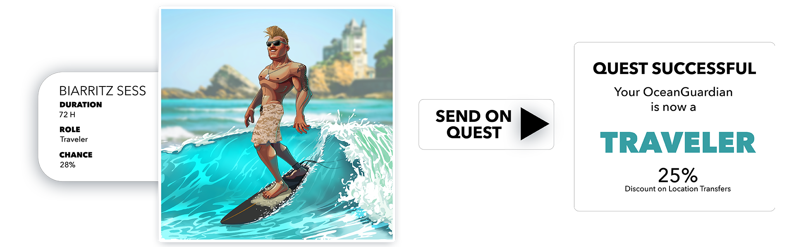

# Quests

Our Quest System is another interesting mechanic we came up with. It will be integrated into the dynamic ‘Role’ attribute of your OceanGuardian. Like with staking, every location will have one or more open quests you can send your OceanGuardian on.

Going on quests, surfers have the chance to learn skills and ultimately take on a role given that they accomplish the quest successfully. The ‘Role’ attribute has been explained above.

The chances for success and the duration a quest is determined by the surfer’s equipped board and the wave he is riding.

As we roll out more complicated mechanics, completing quests successfully will give you the chance to earn special airdrops and upgrades for your boards etc.
