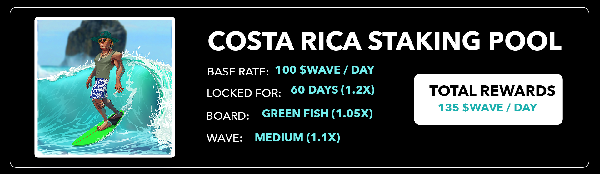

# Staking

Staking your OceanGuardian on our dApp will earn you $WAVE our utility token.\
There is currently a base rate of 60 $WAVE / day and there are several factors that will determine the final yield your OceanGuardian can produce through staking:

* Surfboard of your OG
* Size of the wave your OG is riding
* Location your OG is in


Claiming rewards or unstaking your NFT will come with a 0.02 SOL fee.


There’s been some FUD recently that projects coming out with staking is no longer a bullish news but rather an exit liquidity event.

This is due to the fact that projects release staking without creating any utility for the token that is being farmed. If there are no use-cases for the token, it is evident that it will get dumped and therefore decrease in price.

In the case of our project there will be plenty of use-cases and utilities for the $WAVE token. Therefore we believe we’ll be able to create a stable and sustainable passive income for holders of one or multiple OceanGuardians.
